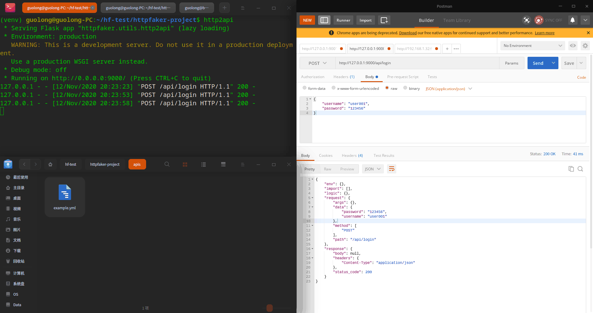

# http2api

#### 介绍
作为`httpfaker`的配套工具，`http2api`可以接收前端请求，直接转换为可被`httpfaker`执行的yaml文件。

#### 使用方式
1. 启动http2api服务
    ```shell script
    # 初始化项目（非必选）
    httpfaker init
    cd httpfaker-project
    # 运行http2api服务，完成后将提供本机9001端口服务
    (venv) guolong@guolong-PC:~/01Work/07MyProject/http-faker$ http2api
     * Serving Flask app "httpfaker.utils.http2api" (lazy loading)
     * Environment: production
       WARNING: This is a development server. Do not use it in a production deployment.
       Use a production WSGI server instead.
     * Debug mode: off
     * Running on http://0.0.0.0:9000/ (Press CTRL+C to quit)
    
    ```
2. 使用postman或前端页面等接口调用工具访问任意接口，访问成功后会在当前目录的apis目录生成相应的yml文件。
    
    ```yaml
    # apis/api_login_POST.yml
    import: []
    env: {}
    request:
      path: /api/login
      method:
      - POST
      data:
        username: user001
        password: '123456'
      args: {}
    logic: {}
    response:
      headers:
        Content-Type: application/json
      body: null
      status_code: 200
    ```
#### 详细参数
```shell script
(venv) guolong@guolong-PC:~/01Work/07MyProject/http-faker$ http2api -h
usage: http2api [-h] [--default-body [DEFAULT_BODY]]
                [--default-status [DEFAULT_STATUS]] [--path [PATH]]
                [--hide-data] [--out-format [OUT_FORMAT]] [--listen [LISTEN]]
                [--port [PORT]]

调用接口生成mock描述文件

optional arguments:
  -h, --help            show this help message and exit
  --default-body [DEFAULT_BODY]
                        Response默认的返回体，指定后生成的Response中的body字段将按照此定义来生成。用法：指定文件
                        路径，文件内容格式可以是json或者yaml！
  --default-status [DEFAULT_STATUS]
                        Response中status_code返回值，默认为200
  --path [PATH]         输出的配置文件存放路径, 默认当前目录下的apis目录
  --hide-data           不转换Request中的请求体和请求参数数据（请求参数和请求体数据仅做参考，不参与实际逻辑）
  --out-format [OUT_FORMAT]
                        转换的配置文件的格式；可选yml和json，默认yml格式
  --listen [LISTEN]     启动服务默认监听地址，默认0.0.0.0
  --port [PORT]         启动服务默认监听端口，默认9000

```