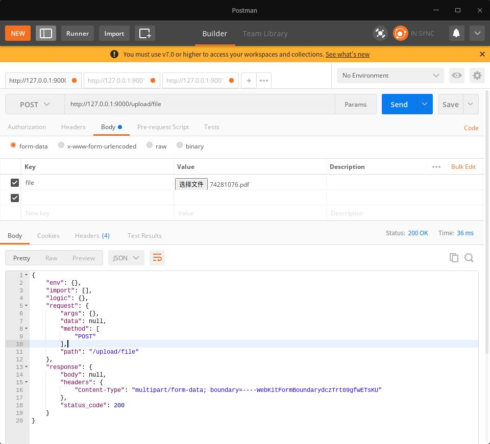
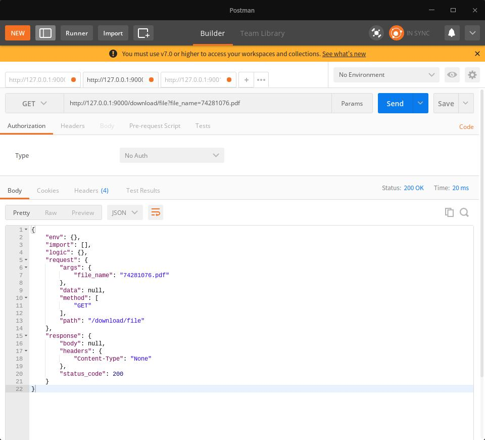

# 使用httpfaker来实现文件上传和下载服务

> 使用httpfaker可以简单的实现文件上传和下载

#### 步骤
##### 1. 首先，我们先定义两个接口
* 文件上传： 

    **请求地址**： /upload/file
    
    **请求方法**： post

* 文件下载

    **请求地址**： /download/file?file_name=xxx.txt
    
    **请求方法**： get
    
##### 2. 使用http2api将接口转换为yaml文件

1. 启动http2api服务
    ```shell script
    http2api
    ```
2. 使用postman调用接口

    
    
    
现在在程序运行目录可以看到生成了两个yaml文件。
    
##### 3. 修改yaml文件

文件上传的yaml文件
```yaml
import: []
env: {}
request:
  path: /upload/file
  method:
    - POST
  data: null
  args: {}
logic:
  step1: "{{ faker.save_file(request.files.get('file')) }}"
  step2: "{{ print(logic.step1) }}"
response:
  headers:
    Content-Type: application/json
  body: '{{ logic.step1 }}'
  status_code: 200
```
在上面的yaml文件中使用到了`faker.save_file`方法，该方法接收flask的request.files对象。
在这里我们将`request.files.get('file')`传给了`save_file`方法。
并在Response的body中引用了save_file方法的返回结果。从而实现了文件上传功能。

文件下载的yaml文件
```yaml
import: []
env: {}
request:
  path: /download/file
  method:
  - GET
  data: null
  args:
    file_name: 74281076.pdf
logic:
  step1: "{{ print('file_name: ',  request.args.file_name) }}"
response:
  # 警告1：当调用方法的返回类型为非字符对象（str,dict,list, tuple）时，不要使用jinja2模板来渲染调用；使用engine参数来调用。否则对象会变成字符串...
  # 警告2：当调用方法的返回类型为非字符对象（str,dict,list, tuple）时，不要使用使用引用，直接赋值给对象即可。使用引用会通过jinja2来渲染，会将任意对象转为str...
  # 由于download方法返回对象是一个Response对象，所以不能直接使用jinja2模板渲染（jinja2模板会将任意对象转为string）
  engine: "download('{{ request.args.file_name }}')"
```
文件下载功能有点特殊，使用到的`download`方法返回一个`flask.Response`对象，该对象不能被jinja2模板渲染，否则会变成一个字符串，从而报错。
所以这里直接在`response`块中引用了`download`方法，`download`方法的返回结果直接赋值给response。从而实现文件下载功能。
##### 4. 自定义方法

上面提到的save_file方法和download方法在当前目录的script目录中，我们可以新建一个Python文件，名称任意，比如`example.py`。
在文件中编写上述方法。
```python
from httpfaker.utils.faker_tool import Provider
import os
from flask import send_from_directory
from flask import Response


class MProvider(Provider):

    def save_file(self, files):
        r = {
            "code": 200,
            "msg": 'upload success',
            "respData": None
        }
        try:
            file_name = files.filename
            files.save(file_name)
            r['respData'] = file_name
        except Exception as e:
            r.update({"code": 1001, 'msg': "upload faild!!! {}".format(e)})
        return r
    
    def download(self, file_name):
        crt_path = os.path.abspath('.')
        if not os.path.exists(file_name):
            return Response(
                response={
                    "code": 1002,
                    "msg": 'file not found!'
                }, status=200, headers={"Content-Type": "application/json"}
            )
        return send_from_directory(crt_path, filename=file_name, as_attachment=True)
```