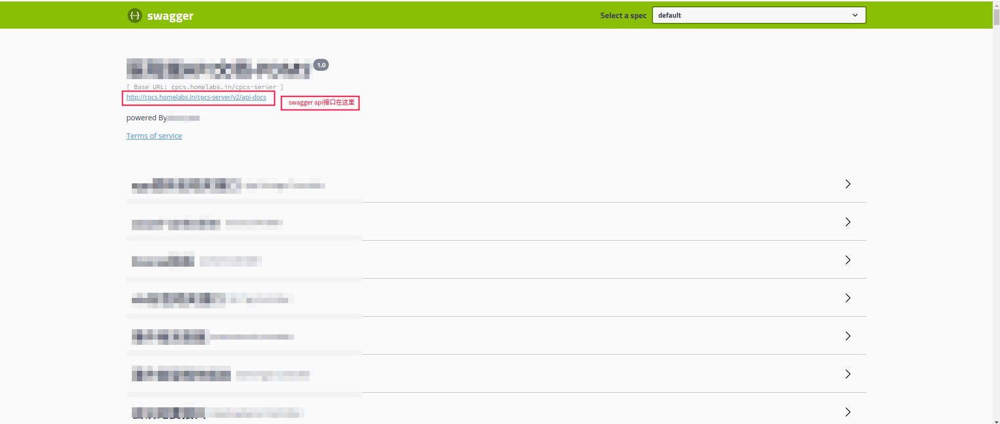

# swagger2api

#### 介绍
作为`httpfaker`的配套工具，`swagger2api`可以将swagger接口文件直接转换为可被`httpfaker`执行的yaml文件。

#### 使用方式
1. 使用swagger2api
    ```shell script
    # 初始化项目（非必选）
    httpfaker init
    cd httpfaker-project
    # 使用swagger2api转换swaggerapi文档
    (venv) guolong@guolong-PC:~/hf-test/httpfaker-project$ swagger2api --url http://192.168.1.166/v2/api-docs
    转换完成，文件所在目录： /home/guolong/hf-test/httpfaker-project/apis
    (venv) guolong@guolong-PC:~/hf-test/httpfaker-project$ ls apis/
    api_login_POST.json               sys_menu_select_GET.yml
    api_login_POST.yml                sys_menu_update_POST.yml
    example.yml                       sys_role_delete_POST.yml
    patient_delete_patientId_GET.yml  sys_role_info_roleId_GET.yml
    patient_info_patientId_GET.yml    sys_role_list_GET.yml
    patient_list_GET.yml              sys_role_save_POST.yml
    sys_config_delete_POST.yml        sys_role_select_GET.yml
    sys_config_info_id_GET.yml        sys_role_update_POST.yml
    sys_config_list_GET.yml           sys_user_delete_POST.yml
    sys_config_save_POST.yml          sys_user_info_GET.yml
    sys_config_update_POST.yml        sys_user_info_userId_GET.yml
    sys_login_POST.yml                sys_user_list_GET.yml
    sys_logout_POST.yml               sys_user_password_POST.yml
    sys_menu_delete_menuId_POST.yml   sys_user_resetPassword_POST.yml
    sys_menu_info_menuId_GET.yml      sys_user_save_POST.yml
    sys_menu_list_GET.yml             sys_user_status_userId_POST.yml
    sys_menu_nav_GET.yml              sys_user_update_POST.yml
    sys_menu_save_POST.yml
    ```
2. swagger 接口地址可在这里找到


3. 转换说明
>swagger接口地址查询到的内容必须是json格式，否则转换会失败。
>非json格式的原因一般是因为接口描述中出现了一些对象不符合json格式要求；找开发人员修改吧。

#### 详细参数
```shell script
(venv) guolong@guolong-PC:~/hf-test/httpfaker-project$ swagger2api -h
usage: swagger2api [-h] [--api-path [API_PATH]] [--url [URL]] [--host [HOST]]
                   [--type [TYPE]]

swagger转api工具, 使用方式： swagger2api --url http://127.0.0.1/v2/api-docs

optional arguments:
  -h, --help            show this help message and exit
  --api-path [API_PATH]
                        生成api描述文件存放路径， 默认apis
  --url [URL]           swagger接口地址
  --host [HOST]         请求地址host，默认：http://127.0.0.1，当url参数中包含请求schema时此参数无效
  --type [TYPE]         转换api文件类型，默认为.yml， 可选json

```